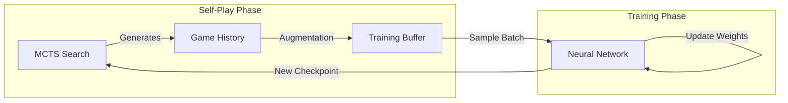

# Alpha-Toe-Zero

**Alpha-Toe-Zero** is a clean, educational implementation of DeepMind's [AlphaZero](https://deepmind.google/blog/alphazero-shedding-new-light-on-chess-shogi-and-go/) algorithm. It masters **Tic-Tac-Toe (2D)** and **4x4x4 3D Tic-Tac-Toe** entirely through self-play reinforcement learning, starting with zero human knowledge.

This project includes a high-performance training pipeline, a CLI for interacting with models, and a modern web-based interactive explainer.

**[Live Demo](https://alpha-toe-zero.nottherealsanta.com)** 

-----

## Installation

Requires **Python 3.11+**.

### 1\. Clone the repository

```bash
git clone https://github.com/nottherealsanta/alpha-toe-zero.git
cd alpha-toe-zero
```

### 2\. Install Dependencies

You can use standard `pip` or `uv` for faster dependency management.

```bash
# Using pip
pip install -e .

# Using uv (Recommended)
uv sync
```

-----

## Usage

The project is divided into 2D (Tic-Tac-Toe) and 3D (Qubic) modules.

### Training a Model

The training pipeline runs self-play games, trains the neural net, and evaluates progress.

```bash
# Train 3x3 Tic-Tac-Toe agent
cd 2d
python main.py

# Train 4x4x4 Qubic agent
cd 3d
python qubic.py
```

### Play Against the AI (CLI)

Once you have a trained model (check the `models/` directory), you can challenge it.

```bash
cd 2d
# Replace with your specific checkpoint path
python play.py --model-path ../models/alphazero_iter_40.pth
```

### Run the Web Interface

The `teach/` directory contains a full web application for playing the 3D game and visualizing the network.

```bash
cd teach
npm install
npm run dev
```

Open `http://localhost:5173` in your browser.

### Run a Tournament

Compare different iterations of your model to measure improvement using Elo ratings.

```bash
cd 2d
python tournament.py \
    --models ../models/alphazero_iter_0.pth ../models/alphazero_iter_40.pth \
    --games-per-pair 20 \
    --mcts-simulations 200
```

-----

## System Architecture

The system follows the standard AlphaZero loop, iterating between generating data via self-play and improving the neural network.



### Neural Network (ResNet)

  * **Input:** The board state encoded into binary planes (Current Player, Opponent).
  * **Backbone:** 4 Residual Blocks with Batch Normalization.
  * **Heads:**
      * **Value Head:** Predicts game outcome `[-1, 1]`.
      * **Policy Head:** Predicts probability distribution over all valid moves.

For a deep dive into the implementation details, see [TECHNICAL\_DOCUMENTATION.md](https://www.google.com/search?q=docs/TECHNICAL_DOCUMENTATION.md).

-----

## Project Structure

```text
alpha-toe/
├── 2d/                  # 3x3 Tic-Tac-Toe Engine
│   ├── main.py          # Training entry point
│   ├── play.py          # CLI game interface
│   ├── tournament.py    # Elo rating system
│   └── export_onnx.py   # Model exporter
├── 3d/                  # 4x4x4 Qubic Engine
│   ├── qubic.py         # 3D training pipeline
│   └── qubic_export.py  # 3D model exporter
├── teach/               # Interactive Web App (React/Vite)
│   ├── src/             # Frontend logic (Game, UI, MCTS)
│   └── public/assets/   # ONNX models for browser inference
├── docs/                # Documentation
│   ├── TECHNICAL_DOCUMENTATION.md  # Detailed architecture docs
│   └── *.ipynb          # Jupyter notebooks for concepts
└── models/              # Checkpoints saved during training
```


## References

This project is based on the following groundbreaking papers:

1.  **AlphaZero:** [Mastering Chess and Shogi by Self-Play with a General Reinforcement Learning Algorithm](https://arxiv.org/abs/1712.01815)
2.  **AlphaGo Zero:** [Mastering the game of Go without human knowledge](https://www.nature.com/articles/nature24270)